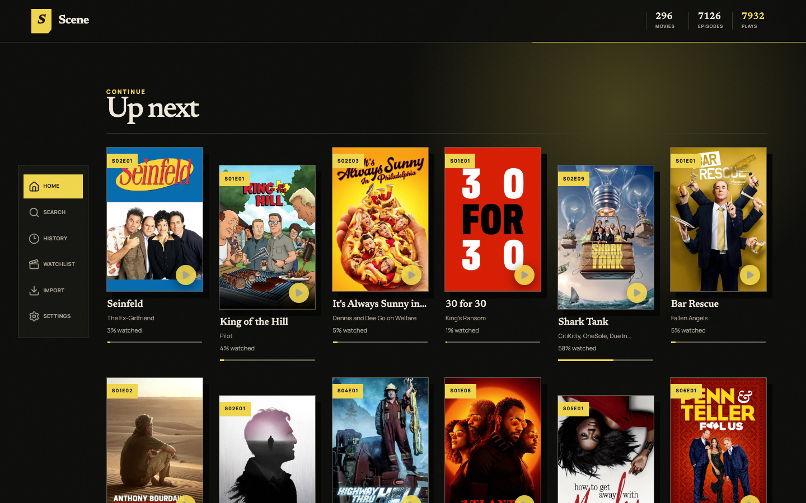

# Scene

Scene is an installable movie and TV tracker for keeping a personal record of what you watch, what you want to watch next, and how far you are through each series.



## Features

- Search movies and television shows using TMDB catalog data.
- Mark movies and individual episodes as watched, including a custom watch date.
- Track episode progress by season, or mark a season and earlier episodes watched in one action.
- Rate titles from 1 to 10 and maintain a watchlist.
- Browse a chronological watch history and a filterable library of watched movies, shows, and episodes.
- See recently watched titles, watchlist picks, statistics, and the next aired episode for in-progress shows on the dashboard.
- Import watch history, ratings, and watchlist items from a Trakt account-export ZIP; unmatched records remain available for review.
- Automatically record movies and episodes from Plex when Plex marks them watched.
- Download a versioned JSON backup of your library, watches, ratings, and watchlist.
- Install as a PWA with offline access to the app shell, recently viewed pages, and artwork.

## Stack

React and Vite power the client; a Cloudflare Worker with D1 stores tracker data. TMDB supplies movie and television metadata. The project also supports self-hosting with Docker.

## Requirements

- Node.js 26 or newer (see `.nvmrc`)
- npm 12 or newer
- A TMDB API read-access token
- A Cloudflare account when deploying to Workers

## Get started

```sh
npm ci
cp .dev.vars.example .dev.vars
# Add your TMDB token and development email to .dev.vars
npm run db:migrate:local
npm run dev
```

Open `http://localhost:5173`. The development identity override only works when `ENVIRONMENT=development`.

## Scripts

```sh
npm run dev              # start the local Vite/Cloudflare runtime
npm run build            # type-check and create a production build
npm run lint             # run static analysis
npm run test             # run unit and API integration tests
npm run test:e2e         # run Playwright browser tests
npm run check            # run formatting, linting, types, tests, and build
```

To run the complete verification suite on a fresh clone:

```sh
npx playwright install chromium
npm run check
npm run test:e2e
```

## Deploy

Choose the deployment path that fits your setup:

- [Cloudflare Workers](./DEPLOYMENT.md) for hosted D1 and Cloudflare Access.
- [Docker with Tailscale](./DOCKER.md) for a private tailnet deployment with local D1 storage.
- [Docker with Cloudflare Tunnel](./CLOUDFLARE.md) for a custom hostname, Cloudflare Access, and local D1 storage.

## iPhone companion

The native iOS 17+ companion lives in [ios/Scene](./ios/Scene). Open `Scene.xcodeproj` in Xcode, select your private TestFlight signing team, and archive the `Scene` scheme.

Before distributing, deploy migration `0003_mobile_sessions.sql`, point `api.scene.nathanlopez.com` at this same Worker, and set `MOBILE_API_HOST=api.scene.nathanlopez.com`. Keep Cloudflare Access on `scene.nathanlopez.com` only: the API hostname must be outside Access. The app opens the protected browser host to pair, then uses a five-minute single-use handoff code to obtain revocable opaque bearer credentials. Access and refresh tokens are never stored in D1, only SHA-256 digests; the app stores the credential pair in Keychain.

The app caches successful reads locally for offline viewing and identifies stale content. It intentionally never queues writes while offline.

## Plex tracking

Open **Settings → Automatic Plex tracking**, enter the username shown on your Plex account,
and copy the generated URL into **Plex Web → Settings → Account → Webhooks**. Plex sends a
`media.scrobble` event after a movie or episode passes its watched threshold; Scene matches its
Plex metadata to TMDB and records the watch once. Webhooks currently require Plex Pass.

On Cloudflare deployments, `MOBILE_API_HOST` must point to the same Worker on a hostname that is
not protected by Cloudflare Access. Scene protects the webhook with a generated 256-bit secret and
stores only its SHA-256 digest. On a private Tailscale deployment, the Plex server must be able to
reach Scene's tailnet URL.
